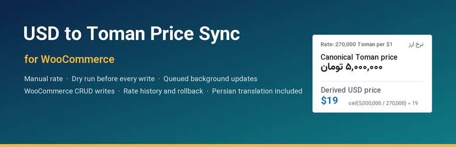
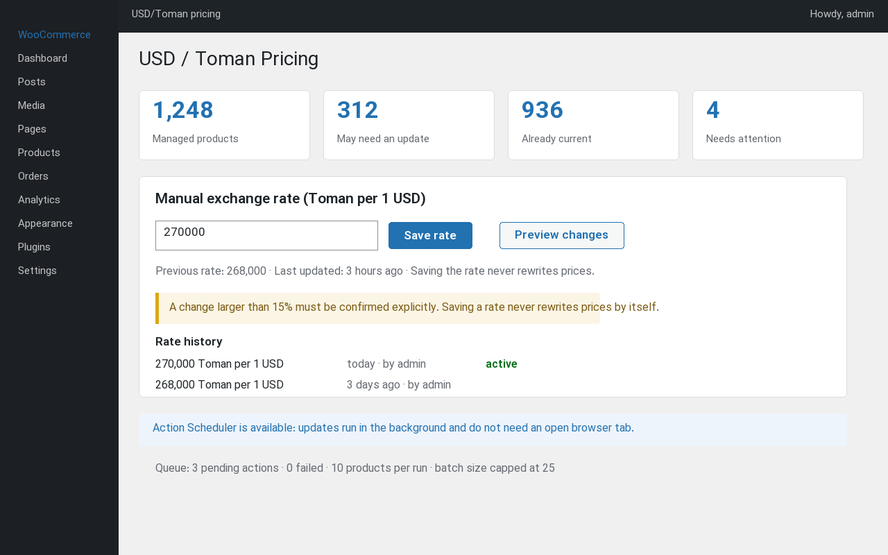
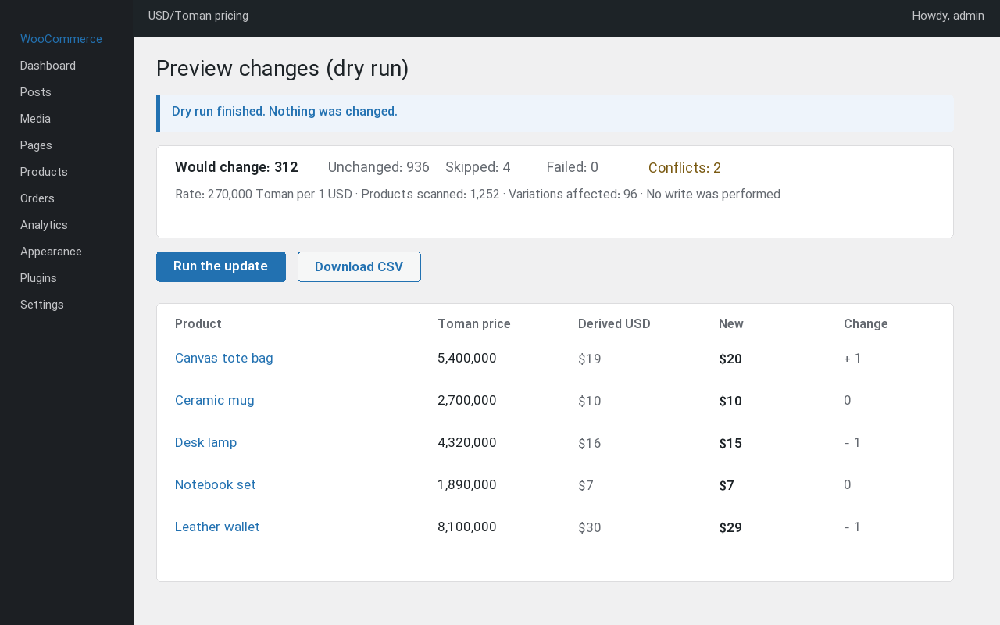
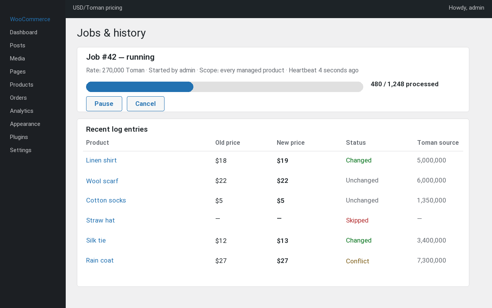
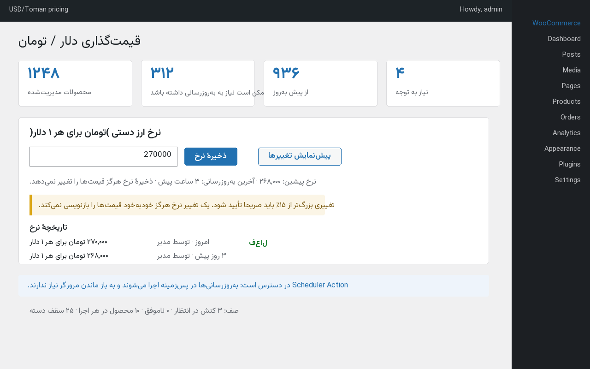
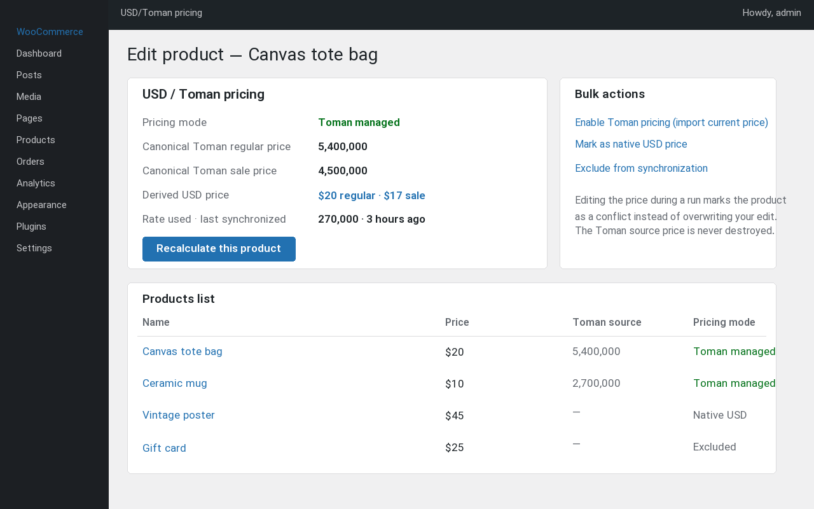

# USD to Toman Price Sync for WooCommerce

Keep product prices in Iranian **Toman** and derive the WooCommerce **USD** price from a manual
USD/Toman rate — with a dry run before every write, queued background updates that survive a closed
browser, and a permanent audit trail.

This repository is the plugin source, the test suite, the CI configuration and the release tooling.
Store owners only need the zip from the [releases page](../../releases).

```
USD price = ceil( Toman price / USD_Toman rate )
```

5,000,000 Toman at a rate of 270,000 Toman per dollar is **$19** (18.518 rounded up). The Toman
value stays stored, so every future update recalculates from the source instead of from a rounded
dollar amount — no rounding drift, ever.

The full specification lives in [issue #1](../../issues/1).



| The rate screen | Dry run | Jobs and logs |
| --- | --- | --- |
|  |  |  |

| Persian admin (`fa_IR`) | Product panel |
| --- | --- |
|  |  |

The listing artwork is generated from source by `python3 wordpress-org/make-artwork.py`; see
[wordpress-org/README.md](wordpress-org/README.md) for the filenames WordPress.org expects and how to
upload them.

## Repository layout

```
usd-to-toman-price-sync-for-woocommerce.php   Plugin header and bootstrap
uninstall.php                                 Cleanup on uninstall
includes/                                     Plugin classes (USDTF\ namespace)
  class-calculator.php                        Price parsing, rounding, formatting
  class-settings.php                          Settings, batch size, rounding, currency mode
  class-database.php / class-installer.php    Custom tables, schema upgrades, uninstall
  class-job.php / class-job-repository.php    Job model and persistence
  class-sync-runner.php                       Discovery, batches, finalize, resume, locking
  class-recorder.php                          The only write path (WooCommerce CRUD)
  class-product-pricing.php                   Per product pricing mode and Toman source
  class-rate-repository.php / class-rate-guard.php  Rate history and typo protection
  class-scheduler.php / class-cron.php / class-lock.php  Queue backends and locking
  class-health.php / class-logger.php         Diagnostics and logging
  admin/                                      Admin screen, REST API, product panel
  frontend/                                   Toman display and Toman transaction mode
assets/                                       Admin CSS/JS
languages/                                    Translation template and shipped catalogues
bin/                                          Build, lint and translation tooling
tests/integration/                            WordPress + WooCommerce integration suite
.github/workflows/                            CI and release automation
```

## Development

Requirements: PHP 7.4+ (8.2 recommended), and `zip` for the packaging tools. Composer is only
needed for the coding standards.

```bash
composer install      # installs PHPCS, WPCS and PHPCompatibility
composer lint         # parse every PHP file
composer phpcs        # coding standards
composer phpcbf       # fix what can be fixed automatically
composer pot          # regenerate languages/*.pot
composer mo           # compile languages/*.po into .mo
composer check        # standards + translation template + compiled catalogues
```

### Translations

English is the source language: the strings in the code are the `.pot` template, generated with
`php bin/make-pot.php`. The plugin ships a complete Persian (`fa_IR`) translation, and
`php bin/make-mo.php` compiles every `languages/*.po` into a binary catalogue. The compiler is plain
PHP, validates that the result reads back entry for entry, and runs in CI with `--check` so a stale or
missing `.mo` file fails the build. `WP_LANG_DIR/plugins` still wins over the bundled files, so a site
that installs a language pack keeps the newer translation.

### Integration suite

The suite runs against a real WordPress installation with WooCommerce active and drives the plugin
through its public services, so prices are written by the real WooCommerce CRUD API. It uses the
SQLite drop-in, so no database server is required.

```bash
# 1. Get WordPress, WooCommerce and the SQLite drop-in somewhere on disk.
#    (any WordPress 6.2+, WooCommerce 7.0+ checkout works)

# 2. Point the suite at it. The scripts accept the path either way:
export USDTF_WP_PATH=/path/to/wordpress

# 3. Write a wp-config.php for the throw away installation.
php tests/integration/make-config.php "$USDTF_WP_PATH"

# 4. Install WordPress, activate WooCommerce and the plugin (idempotent).
php tests/integration/prepare.php "$USDTF_WP_PATH"

# 5. Run the scenarios.
php tests/integration/run.php "$USDTF_WP_PATH"
```

`prepare.php` symlinks the repository into `wp-content/plugins/`, so edits are picked up without
copying. Pass `--from-zip=dist/<archive>.zip` instead to install the built distribution — that is
how CI proves the release zip is complete.

The suite covers the rounding examples from the specification, dry runs, unchanged prices, sale
prices and slicing of variable products, conflict detection and recalculation, invalid and excluded
products, scopes, duplicate job protection, pause/resume/cancel, rate typo protection, rollback,
both currency modes, crash recovery, products deleted mid job and onboarding an existing Toman
catalog, the storefront display, the rounding modes and their guards, the retention window, the
product statuses, the REST API the admin screen uses, the token protected worker endpoint, the cron
maintenance pass and the uninstall behaviour.

## Releases

The zip that is published is the **clean** distribution: source files, assets, the store
`readme.txt` and the translation catalogues (the `.pot` template plus the shipped `.po`/`.mo` files of
the bundled translations). Tests, CI configuration, build tools and development documentation are
excluded, and the archive contains a single top level directory named after the
plugin slug, which is what WordPress expects for an upload.

```bash
php bin/build-dist.php            # dist/<slug>.<version>.zip + .sha256
php bin/build-dist.php --list     # what would be packaged
php bin/build-dist.php --check    # validate the archive that exists
php bin/build-dist.php --source-date=1759680000   # fixed build timestamp
```

The file list comes from `.distignore`, so what ships is reviewable in one place. The builder also
fails when the version in the plugin header and the `Stable tag` in `readme.txt` disagree.

Entry timestamps are fixed at the zip epoch and the only other timestamp, the one in the archive
comment, comes from `--source-date` (or `SOURCE_DATE_EPOCH`). CI and the release workflow pass the
commit date of the checkout, so the same sources built with the same PHP and zlib version produce
the same archive. Deflate output can differ between environments, so a release is verified by
checking the published checksum and by running the suite against the published archive rather than
by assuming byte equality.

Publishing a release:

1. Update the `Version:` header, the `Stable tag:` in `readme.txt` and `CHANGELOG.md`.
2. `php bin/make-pot.php` and `php bin/make-mo.php`, then commit the regenerated template and the
   compiled catalogues.
3. Tag the commit with the version, for example `1.0.1`, and push the tag.
4. The **Release** workflow verifies the tag against the plugin version, lints, checks the
   translation template, builds the zip, validates it and attaches the zip plus its SHA-256
   checksum to a GitHub release.
5. The **Verify release** workflow then downloads that published archive back, checks it against
   the published checksum, inspects its contents and runs the whole integration suite against it
   in a fresh WordPress + WooCommerce install. It also runs on demand (`Verify release` →
   *Run workflow*) for any existing tag, so a published artifact can always be re-proven.

A WordPress.org directory deployment is available as a **manual** workflow run (`Release` →
*Run workflow*, with `publish` enabled). It needs `SVN_USERNAME` and `SVN_PASSWORD` secrets in a
protected `wordpress-org` environment and pushes the same archive to the plugin directory trunk and
tags it.

The listing artwork (icon, banner, screenshots) is generated from source by
`python3 wordpress-org/make-artwork.py` and committed in `wordpress-org/`. It is never part of the
plugin zip: WordPress.org reads it from the `assets/` folder of its own SVN repository, and
[wordpress-org/README.md](wordpress-org/README.md) documents the filenames and the upload.

## What CI checks

| Job | What it proves |
| --- | --- |
| `syntax` | Every PHP file parses on PHP 7.4, 8.0, 8.1, 8.2, 8.3 and 8.4. |
| `standards` | WordPress coding standards, PHPCompatibility and the plugin i18n rules. |
| `translations` | `languages/*.pot` is up to date and every compiled `.mo` matches its `.po` source. |
| `dist` | The clean zip builds, validates, contains no development file and has one top level directory. |
| `integration` | The suite passes against WordPress + WooCommerce, first from the working copy and then from the **built zip**. |

The integration job pins nothing: it downloads the latest WordPress and the latest stable
WooCommerce, so a new upstream release is noticed early.

## License

GPL-2.0-or-later, see the plugin header. WooCommerce is a trademark of Automattic; this plugin is
not affiliated with Automattic.
